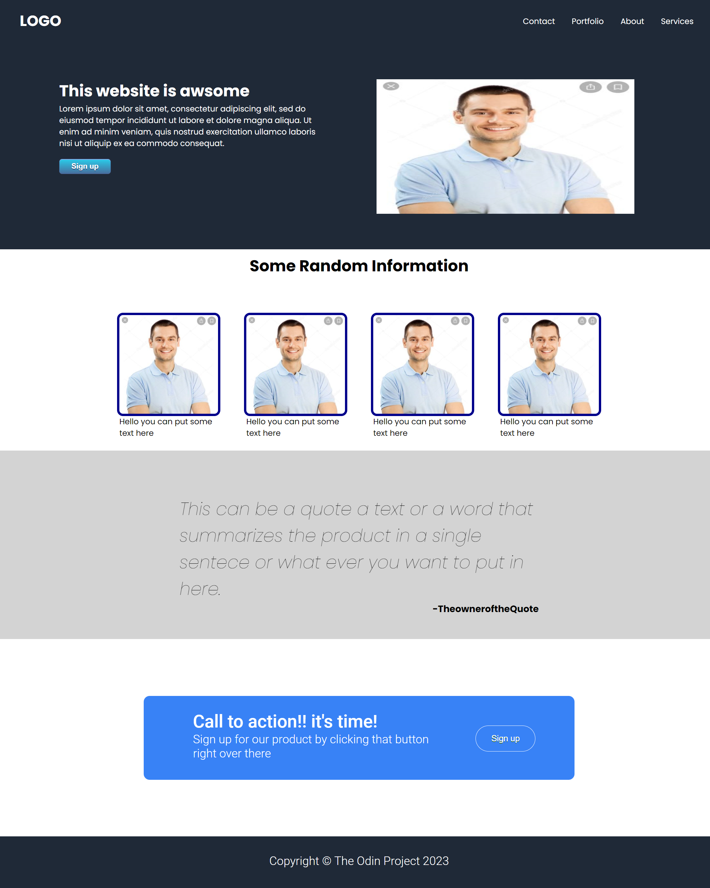

I sticked largely to the Main template provided by odin, tried to be as standart as possible so that people may modify on it if they wish so. I also didn't implement yet media queries so there is that.

<h1><a href="https://mollbach.github.io/Odin-landing-page/">VIEW THE SITE</a></h1>

Project brief: implement a website from a given design.

The final outcome:

